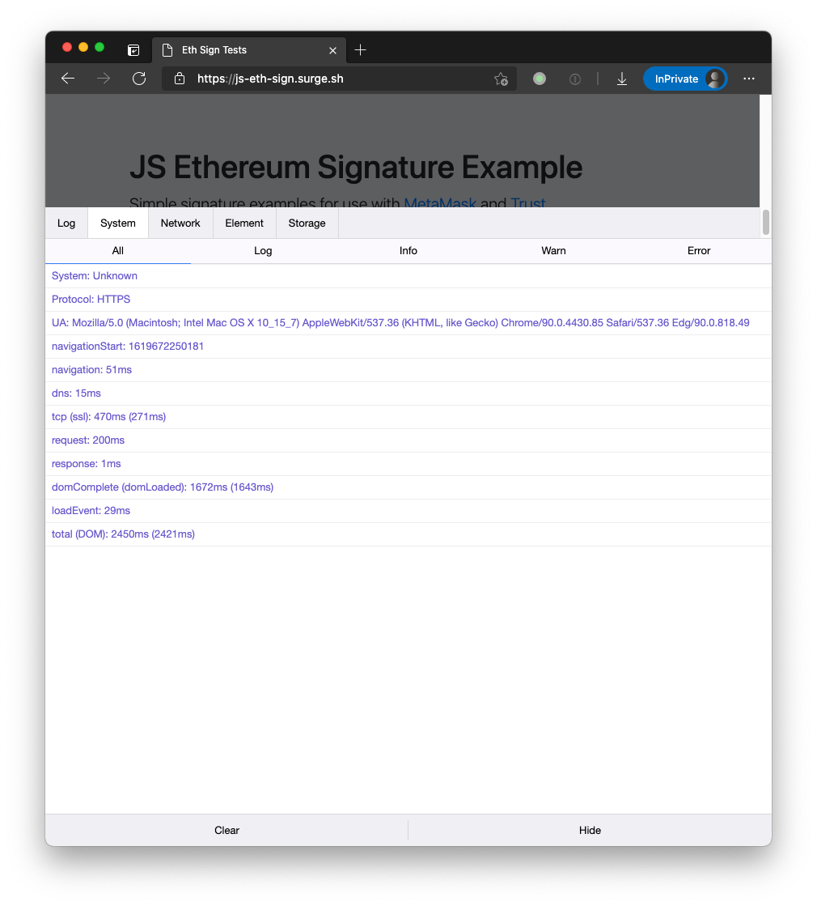
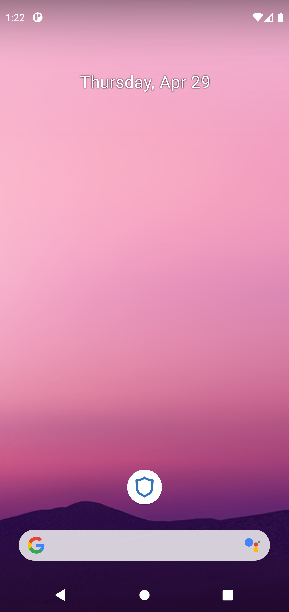
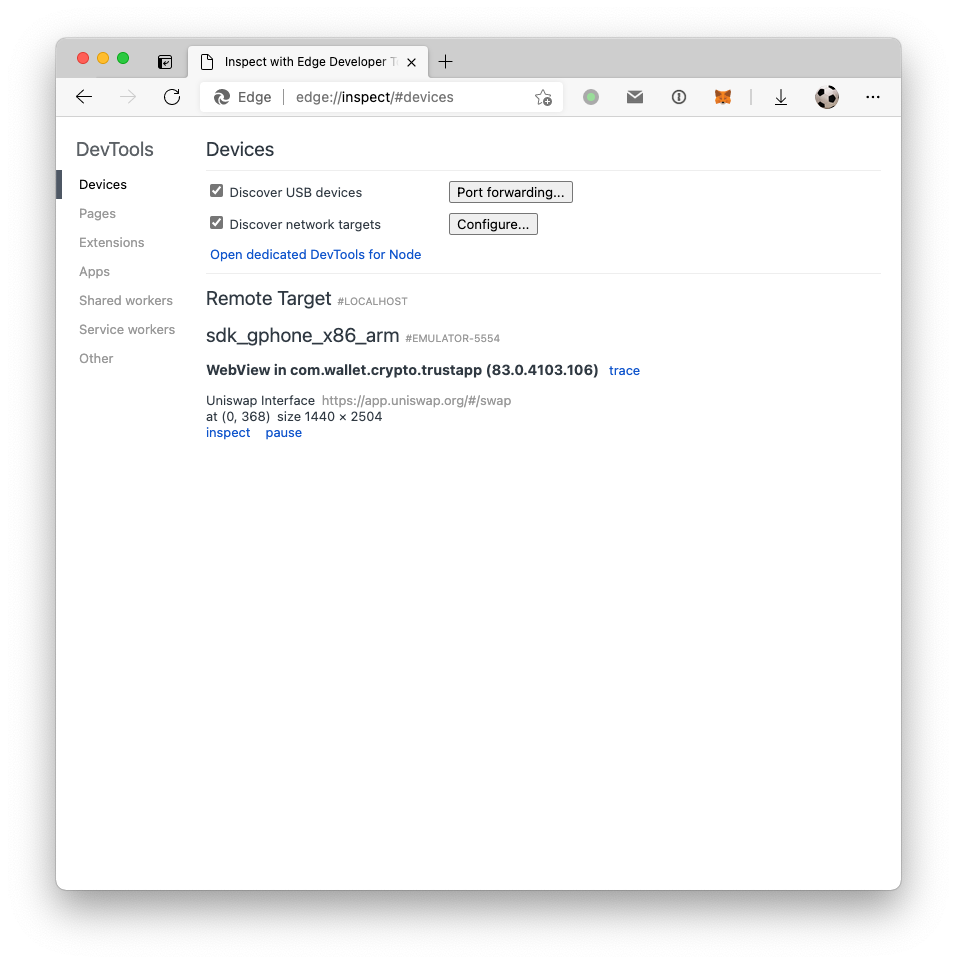

# How to debug your DApp on Trust Wallet

Make sure you have the latest app version, check if there is any new update on Google Play or App Store

## 1. Install a mobile web console

we use [vConsole](https://github.com/Tencent/vConsole) on our test dapp: https://js-eth-sign.surge.sh/, click the bottom green `vConsole` button to see logs.

 

## 2. [Android] Chrome Rmote debugging

simple steps: 

Download Trust Wallet apk from [trustwallet.com](https://trustwallet.com) and drag it to your emulator

Open the dapp in Trust Wallet (1inch.io as example)

 

Visit `chrome://inspect/#devices` or `edge://inspect/#devices` to inspect the web console

## 3. [iOS] Safari WebView debugging

Coming soon...

## Contact us

If above doesn't help, please create an issue on https://github.com/trustwallet/trust-web3-provider and elaborate your question as detail as possible.

1. What's your app version and OS version?
2. Do you see any js error?
3. How to reproduce? please record a video if possible
5. what's the url of your dapp?
