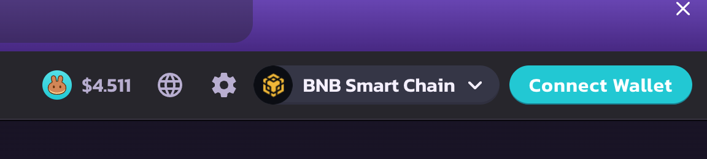
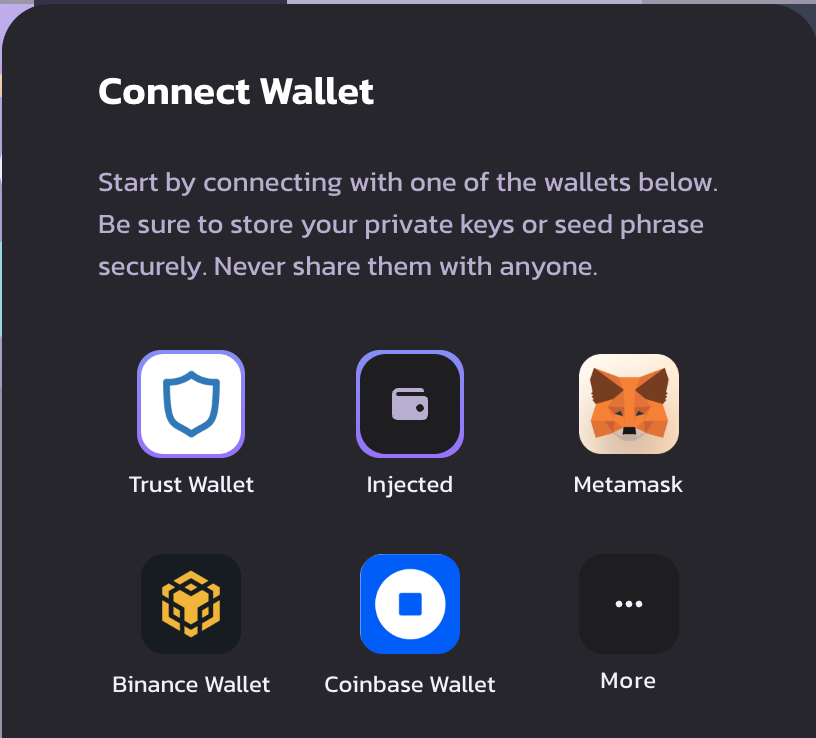

# Adding the Trust Wallet Browser Extension to Your dApp

Adding Trust Wallet to your dApp works largely the same way that you add other wallets to your dApp.

# Overview

As a practical matter, Trust Wallet is [EIP-1193](https://github.com/ethereum/EIPs/blob/master/EIPS/eip-1193.md) compliant, meaning it is an interoperable wallet. Indeed, if you are using other wallet connectors from the following repos, Trust Wallet can in most instances connect in the very same way. Code scaffolded examples are here:

- `web3-react`: [https://github.com/Uniswap/web3-react/blob/v6/example/pages/index.tsx](https://github.com/Uniswap/web3-react/blob/v6/example/pages/index.tsx)
- `web3modal`: [https://github.com/WalletConnect/web3modal/blob/V2/examples/react/src/pages/index.tsx](https://github.com/WalletConnect/web3modal/blob/V2/examples/react/src/pages/index.tsx)
- `web3auth`: [https://web3auth.io/docs/sdk/web/providers/evm](https://web3auth.io/docs/sdk/web/providers/evm)
- `wagmi`: [https://github.com/wagmi-dev/wagmi/tree/main/examples](https://github.com/wagmi-dev/wagmi/tree/main/examples)

# Naming

We suggest you offer a “Trust Wallet” icon on your homepage/navbar/wallet modal, connecting the user’s Trust Wallet browser extension on click, or otherwise sending them to our handy Trust Wallet download page if they don’t have the extension installed yet:  [https://trustwallet.com/download/](https://trustwallet.com/download/).

[https://trustwallet.com/download/](https://trustwallet.com/download/)

Trust Wallet is an EIP-1193 wallet and Trust Wallet can connect in the exact same way to any other EIP-1193 wallet connectors you might be using. For example, take `web3-react`, which offers several connectors. Trust Wallet works with those other wallet connectors!

The key is what is the wallet that is currently set to `window.ethereum`. If it’s Coinbase Wallet, then you can do a `window.ethereum.isCoinbaseWallet` check. Similarly, for Trust Wallet, you can do a `window.ethereum.isTrust` check.

Also, when you list our wallet in your dApp, please make sure you include the proper Trust Wallet icon, naming, and logo properties. You can find them here:

[https://trustwallet.com/press/](https://trustwallet.com/press/)

# 🧸 A Simple Example

We’ll cover a more complex example below with Pancakeswap, but if you want a very simple example using `web3-react` and `injected-connector`, please refer to this useful short article:

[web3-react: Connect Users to MetaMask (or any wallet) From Your Frontend](https://medium.com/coinmonks/web3-react-connect-users-to-metamask-or-any-wallet-from-your-frontend-241fd538ed39)

# 🥞 A More Complicated Example: Pancakeswap

[Pancakeswap](https://pancakeswap.finance) is a great example of a dApp that offers:

- A dedicated Trust Wallet connect wallet option
- A generic Injected wallet option, with which Trust Wallet also works
- Dedicated options for other wallets

And Pancakeswap has open-sourced their frontend code, so you can readily view it and clone it locally/fork here:

[https://github.com/pancakeswap/pancake-frontend](https://github.com/pancakeswap/pancake-frontend)

Let’s walk through the different Pancakeswap options.

## 🏦 Setting up Connect to Trust Wallet with your dApp

Pancakeswap has a straightforward “Connect Wallet” button that you can see on their homepage here:



When you click on “Connect Wallet”, a modal pops up:



In the Pancakeswap frontend repo, you can see the button in `ConnectWalletButton.tsx`:

```jsx
import { Button, ButtonProps } from '@pancakeswap/uikit'
import { WalletModalV2 } from '@pancakeswap/ui-wallets'
import { Trans, useTranslation } from '@pancakeswap/localization'
import { useState } from 'react'
import { useAuth } from 'hooks/useAuth'
import { wallets } from 'config/wallets'

export const ConnectWalletButton = ({ children, ...props }: ButtonProps) => {
  const [open, setOpen] = useState(false)
  const { t } = useTranslation()
  const { login } = useAuth()

  const handleClick = () => {
    setOpen(true)
  }

  return (
    <>
      <Button width="100%" onClick={handleClick} {...props}>
        {children || <Trans>Connect Wallet</Trans>}
      </Button>
      <WalletModalV2
        docText={t('Learn How to Create and Connect')}
        docLink="https://docs.pancakeswap.finance/get-started-aptos/wallet-guide"
        isOpen={open}
        wallets={wallets}
        login={login}
        onDismiss={() => setOpen(false)}
      />
    </>
  )
}
```

And you can see the modal in `WalletModal.tsx`. In that file, the relevant code is below for selecting the wallet you want to connect:

```jsx
<Text color="textSubtle" small p="24px">
          {t(
            'Start by connecting with one of the wallets below. Be sure to store your private keys or seed phrase securely. Never share them with anyone.',
          )}
        </Text>
      )}
      <AtomBox flex={1} py="16px" style={{ maxHeight: '230px' }} overflow="auto">
        <WalletSelect
          displayCount={MOBILE_DEFAULT_DISPLAY_COUNT}
          wallets={walletsToShow}
          onClick={(wallet) => {
            connectWallet(wallet)
            if (wallet.deepLink && wallet.installed === false) {
              window.open(wallet.deepLink)
            }
          }}
        />
      </AtomBox>
```

`walletsToShow` is an array that you can find further up in the file here, which is filtering a wallets array and providing a deep link to download the browser extension if it is not installed on the user’s computer when they click on the wallet icon:

```jsx
const installedWallets: WalletConfigV2<T>[] = wallets.filter((w) => w.installed)
  const walletsToShow: WalletConfigV2<T>[] = wallets.filter((w) => {
    if (installedWallets.length) {
      return w.installed
    }
    return w.installed !== false || w.deepLink
  })
```

Note that this `wallets` array appears to be populated with key-value pairs in `wallets.ts`. Just check that file out, and you’ll see all the relevant wallet values there. Note that if you already have this kind of setup for other popular wallets, then really you just have to add Trust Wallet and its respective values, which you can see below:

```jsx
    {
      id: 'trust',
      title: 'Trust Wallet',
      icon: '/images/wallets/trust.png',
      connectorId: ConnectorNames.Injected,
      installed:
        typeof window !== 'undefined' &&
        !(window.ethereum as ExtendEthereum)?.isSafePal && // SafePal has isTrust flag
        (Boolean(window.ethereum?.isTrust) ||
          // @ts-ignore
          Boolean(window.ethereum?.isTrustWallet)),
      deepLink: 'https://link.trustwallet.com/open_url?coin_id=20000714&url=https://pancakeswap.finance/',
      downloadLink: {
        desktop: 'https://chrome.google.com/webstore/detail/trust-wallet/egjidjbpglichdcondbcbdnbeeppgdph/related',
      },
      qrCode,
    },
```

These values are populated in a `walletsConfig` function, which is called in the `createWallets` function, with a ternary displaying a generic injected wallet icon if there isn’t a default wallet installed.

```jsx
export const createWallets = (chainId: number, connect: any) => {
  const hasInjected = typeof window !== 'undefined' && !window.ethereum
  const config = walletsConfig({ chainId, connect })
  return hasInjected && config.some((c) => c.installed && c.connectorId === ConnectorNames.Injected)
    ? config // add injected icon if none of injected type wallets installed
    : [
        ...config,
        {
          id: 'injected',
          title: 'Injected',
          icon: WalletFilledIcon,
          connectorId: ConnectorNames.Injected,
          installed: typeof window !== 'undefined' && Boolean(window.ethereum),
        },
      ]
}
```

Back in `WalletModel.tsx`, the `walletsToShow` array takes in these wallet values and displays their respective icons in the modal. Clicking on one of the wallet icons fires the `connectWallet` function and appears to be handled in `wagmi.ts`, which is what appears to be what Pancakeswap uses under the hood to connect wallets with their dApps: https://github.com/wagmi-dev/wagmi. Whether you use `wagmi`, `web3-react`, `web3modal` or something else, this section presumes that you have already wired that up in advance. Please refer to the `[README.md](http://README.md)` on their respective repos for steps on how to do that if you haven’t yet.

The `connectWallet` function connects your wallet to the dApp if you have one, and if you don’t it throws an error.

```jsx
const connectWallet = (wallet: WalletConfigV2<T>) => {
    setSelected(wallet)
    setError('')
    if (wallet.installed !== false) {
      login(wallet.connectorId)
        .then((v) => {
          if (v) {
            localStorage.setItem(walletLocalStorageKey, wallet.title)
          }
        })
        .catch((err) => {
          if (err instanceof WalletConnectorNotFoundError) {
            setError(t('no provider found'))
          } else if (err instanceof WalletSwitchChainError) {
            setError(err.message)
          } else {
            setError(t('Error connecting, please authorize wallet to access.'))
          }
        })
    }
  }
```

That should be all that you need to set up Trust Wallet with your dApp. If you require anything else, please don’t hesitate to contact our team at [partnerships@trustwallet.com](mailto:partnerships@trustwallet.com) and on the Trust Wallet Developers Group on Telegram here:

[Trust Developers - Public](https://t.me/trust_developers)